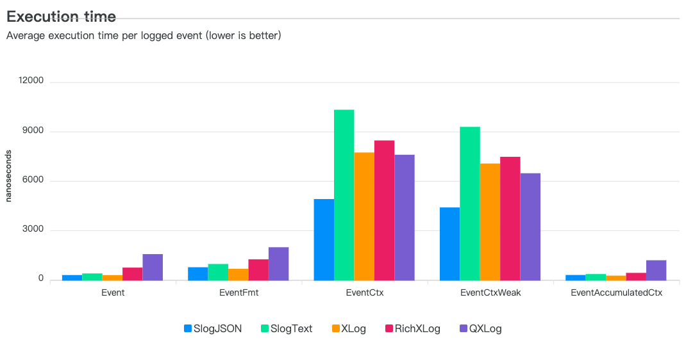

## XLog Benchmarks



#### Benchmark 测试用例说明

- Event VS Disabled
  - Event: 写入Enabled Level 日志
  - Disabled: 写入DisabledLevel日志
- Fmt:
  - 带 Fmt 表示带 fmt.Sprintf 处理写入
- Ctx:
  - 写入携带额外CtxKV属性
- CtxWeak: 
  - 写入携带额外Ctx数组属性

| 类型                     | Level类型  | 写入目标           | Fmt处理 | 实例属性 | 方法属性 |
|:-----------------------|:---------|:---------------|:------|:-----|:-----|
| Event                  | Enabled  | 黑洞(有锁)         | 否     | 无    | 无    |
| Disabled               | Disabled | io.Discard(无锁) | 否     | 无    | 无    |
| EventFmt               | Enabled  | 黑洞(有锁)         | 是     | 无    | 无    |
| DisabledFmt            | Disabled | io.Discard(无锁) | 是     | 无    | 无    |
| EventCtx               | Enabled  | 黑洞(有锁)         | 否     | 无    | KV   |
| DisabledCtx            | Disabled | io.Discard(无锁) | 否     | 无    | KV   |
| EventCtxWeak           | Enabled  | 黑洞(有锁)         | 否     | KV   | 数组   |
| DisabledCtxWeak        | Disabled | io.Discard(无锁) | 否     | KV   | 数组   |
| EventAccumulatedCtx    | Enabled  | 黑洞(有锁          | 否     | KV   | 无    |
| DisabledAccumulatedCtx | Disabled | io.Discard(无锁) | 否     | KV   | 无    |

## 测试脚本

- 准备
```text
(1) install gobenchdata at first
go install go.bobheadxi.dev/gobenchdata@latest
(2) generate node_modules
npm install
```
- 生成 bench 数据

```shell
 go test -bench . -benchmem -benchtime=30s -timeout=120m ./... | gobenchdata --json bench2.json
```

- 编译界面服务

```shell
cd docs && pnpm run build:prod
```

- 启动本地界面

```shell
cd docs && pnpm run server
```

- 访问本地站点 [页面](http://127.0.0.1:4000/)


```html

```